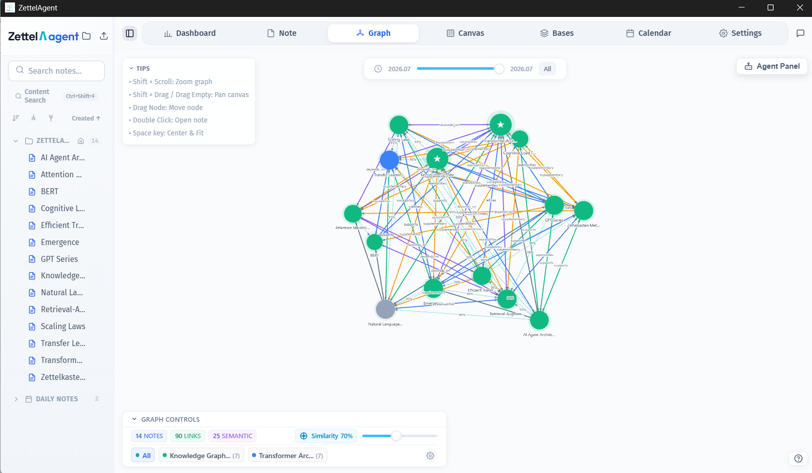
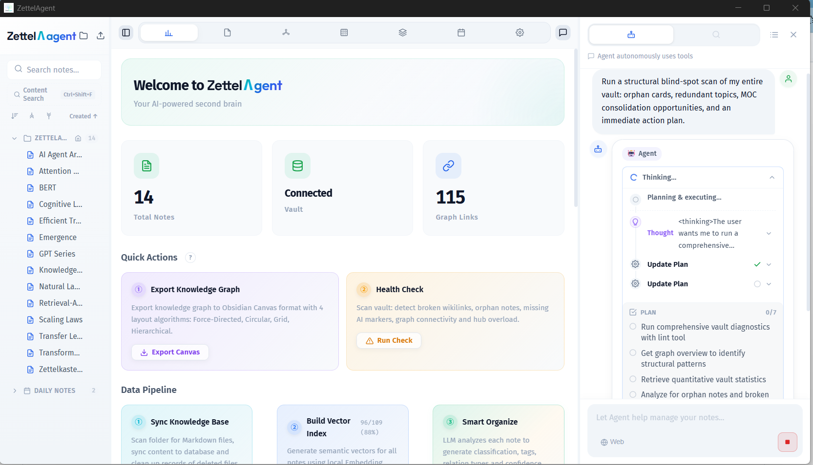

<p align="center">
  
</p>

<h1 align="center">ZettelAgent</h1>

<p align="center">
  <strong>AI-Powered Zettelkasten Desktop Agent</strong><br>
  Your second brain that thinks, reconciles contradictions, and evolves your notes.<br>
  All from a local Markdown folder. No Docker, no cloud, no accounts.
</p>

<p align="center">
  <a href="https://github.com/Poetrynan/ZettleAgent/stargazers"></a>
  <a href="https://github.com/Poetrynan/ZettleAgent/releases"></a>
  
  <a href="https://github.com/Poetrynan/ZettleAgent/blob/main/LICENSE"></a>
</p>

<p align="center">
  
  
  
  
  
</p>

<p align="center">
  <strong>English</strong> | <a href="README_CN.md">中文</a> | <a href="README_JP.md">日本語</a> | <a href="README_KR.md">한국어</a>
</p>

---

## Table of Contents

- [Core Capabilities](#core-capabilities)
- [Interface Showcase](#interface-showcase)
- [Quick Start (end users)](#quick-start-end-users)
- [Build from Source (developers)](#build-from-source-developers)
- [System Requirements](#system-requirements)
- [Comparison](#comparison)
- [Contributing](#contributing)
- [Acknowledgments](#acknowledgments)
- [License](#license)

---

> **Download from [Releases](https://github.com/Poetrynan/ZettleAgent/releases) → install → use.** No Node.js, no Docker, no extra model downloads. The ~300MB installer already includes the nomic embedding model, ONNX Runtime WASM, and PP-OCR — fully offline on your local Markdown folder.

## Core Capabilities

### 🔍 Hybrid Search

Full-text search + semantic vector search with three modes. Ask questions in natural language — AI answers based on your notes.

### 🤖 AI Agent

60 built-in tools, 3 specialized agents working together. Auto-organize notes, detect contradictions, generate link suggestions, batch operations. Write actions require user approval.

### 📈 Knowledge Graph

Discovers hidden semantic connections between notes. PageRank importance scoring, community clustering, local graph, shortest path discovery.

### 🎨 Intelligent Canvas

Obsidian-compatible whiteboard with Bézier curves, PDF/web embeds, smart groups. AI auto-layout, direct Agent control.

### 🧠 Built-in Embedding Engine

nomic-embed-text-v1.5 is **bundled in the installer** (WASM, optional WebGPU). Zero configuration, no API keys, no download after install.

### 🔒 Local-First

All data stays on your machine. AI writes into `<!-- @generated -->` blocks, never touching your original content. Supports Zettelkasten, PARA, CODE, GTD and 8 methodologies total.

---

## Interface Showcase





---

## Quick Start (end users)

1. Download the installer from [Releases](https://github.com/Poetrynan/ZettleAgent/releases)
2. Install and open the app — **no extra downloads**
3. Configure your LLM API in Settings (OpenAI / Claude / Gemini / Ollama and more)

### Build from Source (developers)

```bash
git clone https://github.com/Poetrynan/ZettleAgent.git
cd ZettleAgent
npm install
npm run tauri dev    # Development mode
npm run tauri build  # Release installer (runs build:prod — fetches models once at build time)
```

Large assets (embedding model, ORT WASM, fonts) are **not** in the git repo. `tauri build` prepares them automatically for the installer; end users never run this step.

### System Requirements

| Platforms | Installer size | Recommended RAM |
|-----------|----------------|-----------------|
| **Windows** (fully supported); macOS / Linux (CI builds, experimental) | ~300MB (models included) | 8GB+ (local embedding) |

---

## Comparison

| | ZettelAgent | Obsidian + Plugins | Notion AI | Logseq |
|---|:---:|:---:|:---:|:---:|
| Local-first, zero cloud | ✅ | ✅ | ❌ | ✅ |
| Built-in AI Agent (60 tools + 3 agents) | ✅ | ⚠️ 3rd-party | ⚠️ Limited | ❌ |
| Hybrid search (FTS + Vector RRF) | ✅ | ⚠️ Plugin | ❌ | ❌ |
| Auto-reconciliation | ✅ | ❌ | ❌ | ❌ |
| AI Intelligent Canvas (groups + layout) | ✅ | ✅ | ❌ | ✅ |
| Built-in Embedding (in installer, zero download) | ✅ | ❌ | ❌ | ❌ |
| AI Long-term Memory (cross-session) | ✅ | ❌ | ⚠️ | ❌ |
| Selection AI (Rewrite/Summarize/Translate) | ✅ | ⚠️ Plugin | ✅ | ❌ |
| Web Search (DuckDuckGo) | ✅ | ⚠️ Plugin | ⚠️ | ❌ |
| Multi-format Import (PDF/DOCX/OCR) | ✅ | ⚠️ Plugin | ⚠️ | ❌ |
| Database View (Notion-style table) | ✅ | ⚠️ Dataview | ✅ | ❌ |
| Chat History Persistence | ✅ | ❌ | ✅ Cloud | ❌ |
| Approval Gate (write safety) | ✅ | ❌ | ❌ | ❌ |
| Temporal Knowledge Evolution | ✅ | ❌ | ❌ | ❌ |
| Knowledge Gap Analysis | ✅ | ❌ | ❌ | ❌ |
| 8 Methodology Support | ✅ | ⚠️ Plugin | ❌ | ❌ |
| MCP Protocol (SSE + stdio) | ✅ | ❌ | ❌ | ❌ |
| One installer, zero runtime deps | ✅ | ⚠️ Electron | ❌ Web | ⚠️ Electron |

---

## Contributing

We welcome contributions from the community! Whether you're fixing bugs, improving documentation, or adding new features, your help is appreciated.

Please read our [Contributing Guidelines](CONTRIBUTING.md) before submitting a pull request.

## Acknowledgments

Built on the shoulders of: [Zettelkasten](https://luhmann.surge.sh/communicating-with-slip-boxes) · [Obsidian](https://obsidian.md/) · [sqlite-vec](https://github.com/asg017/sqlite-vec) · [Tauri](https://tauri.app/) · [pulldown-cmark](https://github.com/raphlinus/pulldown-cmark) · [DeepSeek](https://www.deepseek.com/)

---

## License

Apache License 2.0 — Free to use and modify. **Credit the original author in commercial products.** See [LICENSE](LICENSE).

---

## Star History

[](https://star-history.com/#Poetrynan/ZettleAgent&Date)
