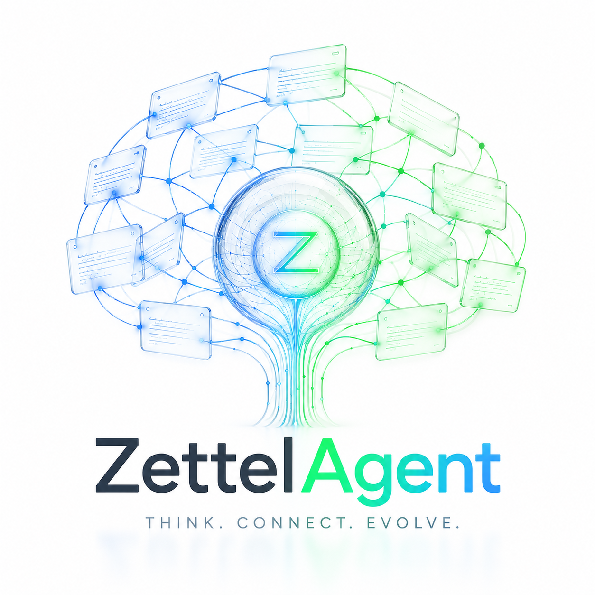
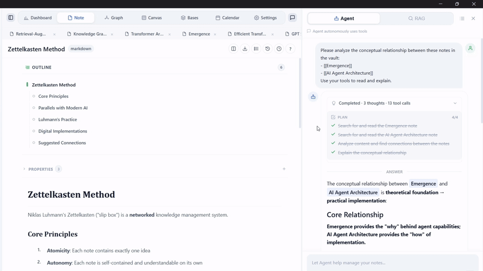

<div align="center">

  <a href="https://github.com/Poetrynan/ZettleAgent">
    
  </a>

  # ZettelAgent

  ### AI 驱动的 Zettelkasten 桌面智能体

  *你的第二大脑——能思考、能发现矛盾、能让你的笔记自我进化。*  
  一切都在本地 Markdown 文件夹中完成 — **无需 Docker、无需云端、无需账号。**

  <!-- Badges -->
  <p>
    <a href="https://github.com/Poetrynan/ZettleAgent/stargazers"></a>
    <a href="https://github.com/Poetrynan/ZettleAgent/releases"></a>
    
    <a href="https://github.com/Poetrynan/ZettleAgent/blob/main/LICENSE"></a>
  </p>

  <!-- Tech stack -->
  <p>
    
    
    
    
    
  </p>

  <!-- Language switcher -->
  <p>
    <a href="README.md">English</a> · <strong>中文</strong> · <a href="README_JP.md">日本語</a> · <a href="README_KR.md">한국어</a>
  </p>

</div>

---

> ### 🚀 [从 Releases 下载](https://github.com/Poetrynan/ZettleAgent/releases) → 安装 → 即用
> 
> 无需 Node.js、Docker，也无需再下载模型。约 300MB 安装包已内置 nomic 嵌入模型、ONNX Runtime WASM、PP-OCR，安装后完全离线，直接操作本地 Markdown 文件夹。

---

## 📑 目录

- [✨ 核心能力](#-核心能力)
- [📸 界面展示](#-界面展示)
- [🏁 快速开始（终端用户）](#-快速开始终端用户)
- [🛠 从源码构建（开发者）](#-从源码构建开发者)
- [💻 系统要求](#-系统要求)
- [⚔️ 竞品对比](#️-竞品对比)
- [🤝 参与贡献](#-参与贡献)
- [🙏 致谢](#-致谢)
- [📜 许可证](#-许可证)

---

## ✨ 核心能力

### 🔍 混合搜索
全文检索 + 语义向量搜索，三种模式一键切换。自然语言提问，AI 基于你的笔记上下文回答。

### 🤖 AI Agent
60 个内置工具，3 个专业 Agent 协作。自动整理笔记、检测矛盾、生成连接建议、批量操作。写入操作需用户审批。

### 📈 知识图谱
自动发现笔记间的隐性语义关联。PageRank 重要度评分、社区聚类、局部图谱、最短路径发现。

### 🎨 智能画布
Obsidian 兼容的白板，支持贝塞尔曲线、PDF/网页嵌入、智能分组。AI 自动布局，Agent 可直接操控。

### 🧠 内置嵌入引擎
nomic-embed-text-v1.5 **打进安装包**（WASM，可选 WebGPU）。零配置、无需 API 密钥，安装后无需再下载。

### 🔒 本地优先
全部数据留在你的机器上。AI 内容写入 `<!-- @generated -->` 块，永远不碰你的原始内容。支持 Zettelkasten、PARA、CODE、GTD 等 8 种方法论。

---

## 📸 界面展示

<div align="center">

| 知识图谱视图 | AI Agent 实战 |
|:---:|:---:|
|  |  |

<br>

### 知识图谱 — 交互式探索


</div>

---

## 🏁 快速开始（终端用户）

1. 从 [Releases](https://github.com/Poetrynan/ZettleAgent/releases) 下载对应平台安装包
2. 安装并打开 — **无需额外下载**
3. 在设置中配置 LLM API（OpenAI / Claude / Gemini / Ollama 等）

---

## 🛠 从源码构建（开发者）

```bash
git clone https://github.com/Poetrynan/ZettleAgent.git
cd ZettleAgent
npm install
npm run tauri dev    # 开发模式（首次运行会自动生成 src-tauri/gen/schemas/）
```

> **说明：** `src-tauri/gen/` 由 Tauri 自动生成，不纳入版本控制。  
> 首次运行 `npm run tauri dev` 时会自动创建 `capabilities/default.json` 引用的 schema 文件，无需手动操作。

打 Release 安装包：

```bash
npm run tauri build  # 自动执行 build:prod（拉取模型、打包所有资源）
```

大体积资源（嵌入模型、ORT WASM、字体）**不在** git 仓库中。`tauri build` 会在打包时自动下载并内置；终端用户无需执行此步骤。

---

## 💻 系统要求

| 平台 | 安装包体积 | 建议内存 |
|------|------------|----------|
| **Windows**（完整支持）· macOS / Linux（CI 构建，实验性） | 约 300MB（含模型） | 8GB+（本地嵌入） |

---

## ⚔️ 竞品对比

| | ZettelAgent | Obsidian + 插件 | Notion AI | Logseq |
|---|:---:|:---:|:---:|:---:|
| 本地优先，零云端 | ✅ | ✅ | ❌ | ✅ |
| 内置 AI Agent（60 工具 + 3 Agent） | ✅ | ⚠️ 第三方 | ⚠️ 有限 | ❌ |
| 混合搜索（FTS + 向量 RRF） | ✅ | ⚠️ 插件 | ❌ | ❌ |
| 自动矛盾检测与调和 | ✅ | ❌ | ❌ | ❌ |
| AI 智能画布（分组 + 自动布局） | ✅ | ✅ | ❌ | ✅ |
| 内置嵌入（安装包自带，零下载） | ✅ | ❌ | ❌ | ❌ |
| AI 长期记忆（跨会话） | ✅ | ❌ | ⚠️ | ❌ |
| 选中文本 AI（改写/摘要/翻译/扩写） | ✅ | ⚠️ 插件 | ✅ | ❌ |
| 联网搜索（DuckDuckGo） | ✅ | ⚠️ 插件 | ⚠️ | ❌ |
| 多格式导入（PDF/DOCX/图片 OCR） | ✅ | ⚠️ 插件 | ⚠️ | ❌ |
| 数据库视图（Notion 风格表格） | ✅ | ⚠️ Dataview | ✅ | ❌ |
| 聊天记录持久化 | ✅ | ❌ | ✅ 云端 | ❌ |
| 写入审批门控（Agent 安全） | ✅ | ❌ | ❌ | ❌ |
| 时间维度知识演进 | ✅ | ❌ | ❌ | ❌ |
| 知识盲区分析 | ✅ | ❌ | ❌ | ❌ |
| 8 种方法论支持 | ✅ | ⚠️ 插件 | ❌ | ❌ |
| MCP 协议（SSE + stdio） | ✅ | ❌ | ❌ | ❌ |
| 一个安装包，零运行时依赖 | ✅ | ⚠️ Electron | ❌ Web | ⚠️ Electron |

---

## 🤝 参与贡献

欢迎社区贡献！无论是修复问题、改进文档，还是添加新功能，我们都非常感谢。

提交 Pull Request 前请先阅读 [贡献指南](CONTRIBUTING_CN.md)。

---

## 🙏 致谢

ZettelAgent 站在这些开源项目的肩膀上：[Zettelkasten](https://luhmann.surge.sh/communicating-with-slip-boxes) · [Obsidian](https://obsidian.md/) · [sqlite-vec](https://github.com/asg017/sqlite-vec) · [Tauri](https://tauri.app/) · [pulldown-cmark](https://github.com/raphlinus/pulldown-cmark) · [DeepSeek](https://www.deepseek.com/)

---

## 📜 许可证

Apache License 2.0 — 免费使用和修改，**商业产品须注明原作者**。详见 [LICENSE](LICENSE)。

---

<!-- Star History -->
<div align="center">

  ## ⭐ Star History

  [](https://star-history.com/#Poetrynan/ZettleAgent&Date)

</div>
