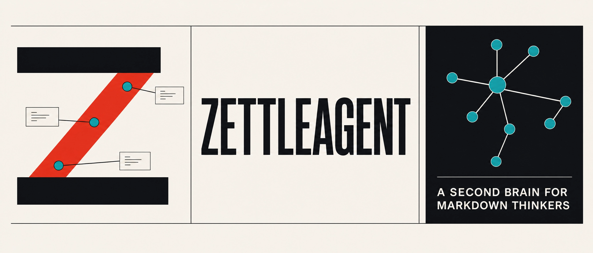
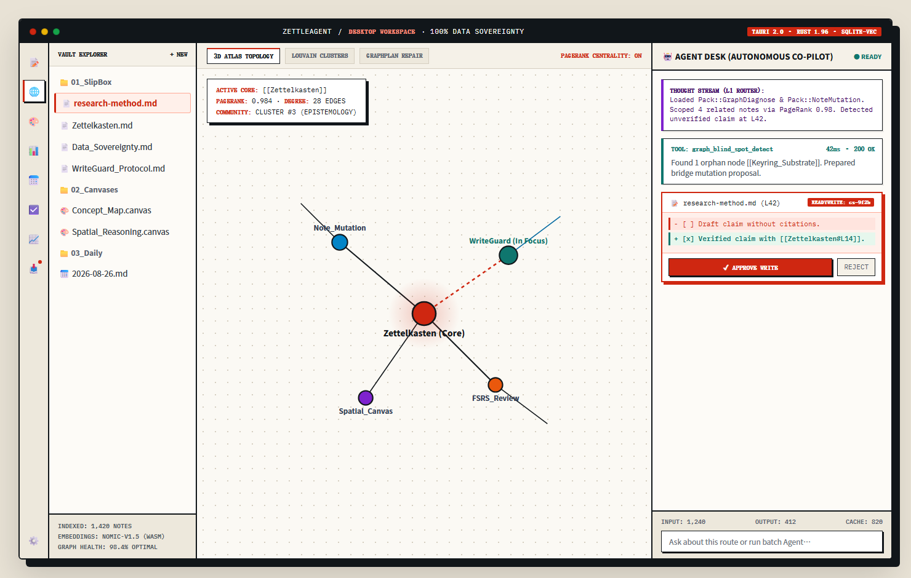
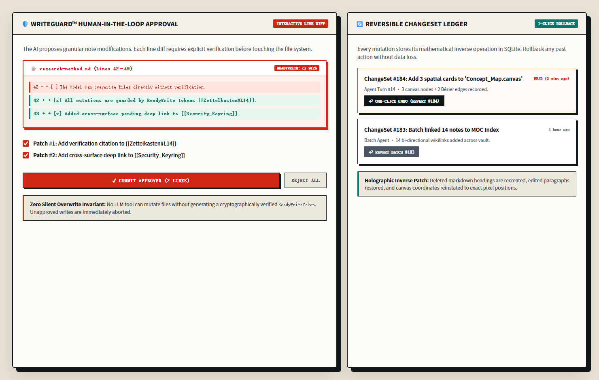
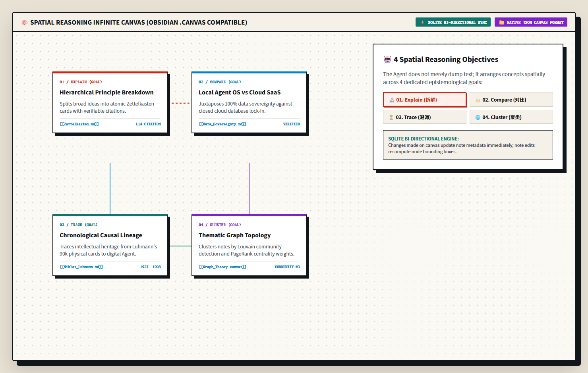
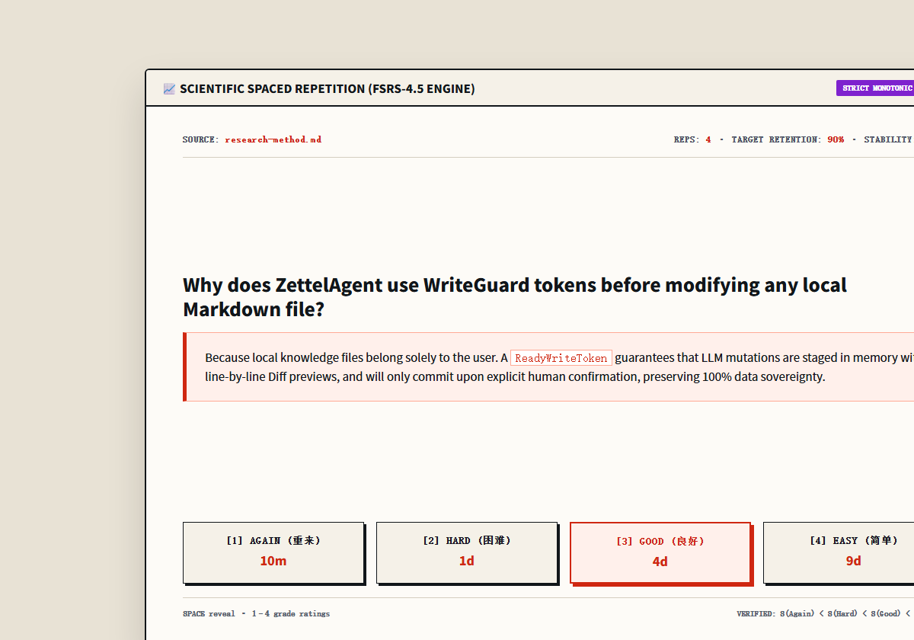

<div align="center">

  # ZettelAgent

  ### 本地优先 · 原生 AI 智能体的卡片盒知识操作系统

  *你的第二大脑——能思考、能审查矛盾、能让你的笔记自我进化。*  
  全部基于本地纯文本 Markdown 文件夹 — **无需 Docker、无需云端绑定、零遥测。**

  <!-- Badges -->
  <p>
    <a href="https://poetrynan.github.io/zettelagent.org/"></a>
    <a href="https://github.com/Poetrynan/ZettleAgent/stargazers"></a>
    <a href="https://github.com/Poetrynan/ZettleAgent/releases"></a>
    
    <a href="https://github.com/Poetrynan/ZettleAgent/blob/main/LICENSE"></a>
  </p>

  <!-- Tech stack -->
  <p>
    
    
    
    
    
    
  </p>

  <!-- Language switcher -->
  <p>
    <a href="README.md">English</a> · <strong>中文</strong> · <a href="README_JP.md">日本語</a> · <a href="README_KR.md">한국어</a>
  </p>

</div>

---

> ### 🚀 [从 Releases 下载安装包](https://github.com/Poetrynan/ZettleAgent/releases) · 🌐 [访问在线官网 · zettelagent.org](https://poetrynan.github.io/zettelagent.org/)
> 
> 无需 Node.js、无需 Docker，也无需额外下载模型。独立安装包已内置离线 nomic 向量引擎、ONNX Runtime WASM 与本地离线 OCR，安装后完全私密离线运行，直接操作本地 Markdown 笔记库。

---

## 📑 目录

- [✨ 核心架构与能力](#-核心架构与能力)
- [📸 界面展示](#-界面展示)
- [⚔️ 深度架构与竞品对比](#️-深度架构与竞品对比)
- [🏁 快速开始（终端用户）](#-快速开始终端用户)
- [🛠 从源码构建（开发者）](#-从源码构建开发者)
- [💻 系统要求](#-系统要求)
- [🤝 参与贡献](#-参与贡献)
- [🙏 致谢](#-致谢)
- [📜 许可证](#-许可证)

---

## ✨ 核心架构与能力

### 🛡️ WriteGuard 写入守卫与全息可逆撤销 (100% 数据主权)
- **人机协同写入门禁**：Agent 绝不会静默覆盖你的任何文件。所有修改提议均必须持有 `READYWRITE` 凭证，并提供交互式行级 Diff 预览，供用户逐行勾选确认。
- **100% 全息可逆撤销账本 (ChangeSet)**：每一次操作均完整保存精确的逆向补丁。被改的文本可秒级还原、删除的节点可重生、断开的连线可精准回到原始坐标。

### 🤖 原生自主 Agent (6 大专属领域工具包)
- **领域工具包 (Domain Packs)**：原子笔记操作、向量与混合检索、图谱拓扑诊断、白板空间推理、工作区健康巡检与网络深度提取。
- **三层混合意图路由 (L0/L1/L2)**：高置信请求走 L0 规则直通（0ms、0 Token）；仅在复杂长链任务时升级为 L2 大模型自主规划。
- **本地 7B/14B 小模型深度适配**：动态装载领域 Schema，单回合节省 4,000+ Tokens，在 Ollama / vLLM 本地小模型上做到 0% 工具调用幻觉。

### 🧠 数学级图谱拓扑与盲区诊断 (GraphPlan)
- **图论拓扑算法**：实时计算 **PageRank 节点重要度评分**，运行 **Louvain 社群发现算法**，探索最短概念桥接路径。
- **GraphPlan 盲区修复**：自动探测孤立笔记、断链与语义盲区，一键生成结构性修复计划。

### 🎨 白板空间推理引擎 (Obsidian Canvas 兼容)
- **4 大空间推理目标**：`explain` (层级拆解)、`compare` (矩阵对照)、`trace` (因果与时序溯源)、`cluster` (主题聚类)。
- **双向编译**：无限白板连线与 SQLite 数据库实现双向编译，支持 AI 自动力导向布局与增量更新。

### 🔐 操作系统级硬件凭据保护 (OS Keyring Substrate)
- **硬件级安全存储**：API 密钥与模型凭据直接通过 Windows DPAPI 与 macOS Keychain 硬件级加密，前端 WebView 与本地 JSON 配置文件中 0 明文。
- **纯离线向量数据库**：SQLite-vec + FTS5 纯本地嵌入与混洗，零云端遥测。

### 📈 科学间隔重复系统 (FSRS-4.5)
- **现代记忆保持算法**：内置最新 FSRS-4.5 现代间隔重复算法，具备严格的单调性不变量守护与长期情节记忆库。

---

## 📸 界面展示（全新改版桌面端工作台）

<div align="center">

### 1. 三栏式桌面知识操作系统 & 3D 拓扑图谱
*交互式 PageRank 节点权重图谱、可折叠文件浏览器与原生自主 Agent Desk。*



<br>

| 2. WriteGuard™ 行级 Diff 审批与撤销账本 | 3. 白板空间推理引擎 (Obsidian 兼容) |
|:---:|:---:|
|  |  |
| *ReadyWrite 凭证门禁、逐行勾选批准与 100% 一键回滚* | *4 大空间推理目标 (拆解/对比/溯源/聚类) + SQLite 双向编译* |

<br>

### 4. 科学间隔重复系统 (FSRS-4.5 引擎)
*基于现代 FSRS 记忆算法、严格单调性不变量守护与长效情节记忆库。*



</div>

---

## ⚔️ 深度架构与竞品对比

| 对比维度 | **ZETTLEAGENT (推荐)** | **OBSIDIAN** | **LOGSEQ** | **NOTION / MEM** |
| :--- | :--- | :--- | :--- | :--- |
| **AI 工作模式** | 🚀 **原生自主 Agent**（6大领域专属工具包、三层混合路由、思维链实时流） | ⚠️ **高度依赖第三方插件**（Smart Connections/Copilot 碎片化，无统一状态机） | ⚠️ **仅实验性插件**（无自主工具闭环与上下文预算守卫） | ☁️ **云端黑盒写作辅助**（简单续写/总结，无法自主调用多维工具链） |
| **本地 7B/14B 小模型优化** | ⚡ **深度剪裁与 Schema 优化**（动态装载领域包省 4000+ Tokens，0% 工具调用幻觉） | ⚠️ **插件普遍预设云端 GPT-4**（本地小模型极易报错、幻觉或超窗崩溃） | ❌ **无本地小模型优化** | ❌ **不支持本地 Ollama 私有模型** |
| **文件修改安全门禁** | 🛡️ **WriteGuard 门禁 + 行级 Diff 局部勾选批准 + ReadyWrite 凭据** | ⚠️ **插件直接覆写文件**（仅依赖简易文件历史，无 AI 差异审查门） | ⚠️ **直接覆写文件**（依赖手工 Git 提交或备份） | ☁️ **直接替换云端块**（只能全篇历史回滚，无逐行审查） |
| **全息可逆撤销 (Undo)** | 🔄 **100% 可逆 ChangeSet 账本**（一键无损撤销文本、白板节点与图谱连线） | ❌ **无跨文件与画板的逆向补丁账本** | ❌ **仅能通过命令行 git revert** | ❌ **无细粒度 AI 操作回滚账本** |
| **图谱计算与拓扑算法** | 🧠 **3D/2D 拓扑 + PageRank 权重 + Louvain 社群发现 + GraphPlan 盲区诊断** | ⚠️ **仅普通可视化图谱**（无原生 PageRank 权重与社群发现算法） | ⚠️ **基础 2D 关系图**（无网络拓扑分析与盲区诊断） | ❌ **不支持网络图谱**（仅层级树状目录） |
| **白板空间推理引擎** | 🎨 **4 大空间推理目标 (拆解/对比/追溯/聚类) + AI 自动布局 + SQLite 双向编译** | ⚠️ **纯手工拖拽白板**（AI 插件仅能追加零散文本框） | ⚠️ **基础白板插件**（无目标驱动的 AI 空间推理） | ❌ **无无限白板空间** |
| **密钥存储与隐私遥测** | 🔐 **系统硬件级密码库 (DPAPI/Keychain) + 纯离线 SQLite-vec + 零云端遥测** | ⚠️ **本地 Markdown，但插件多以明文 JSON 存储 API Key** | ⚠️ **插件配置多为明文** | ☁️ **商业云端托管**（数据全部对服务商可见） |
| **科学间隔重复系统** | 📈 **内置最新 FSRS-4.5 现代记忆算法（单调性守护）+ 情节记忆实体库** | ⚠️ **需外挂插件（多基于旧版 SM-2 算法）** | ⚠️ **内置简易 flashcard（旧算法）** | ❌ **无原生间隔复习与记忆系统** |

---

## 🏁 快速开始（终端用户）

1. 从 [Releases 页面](https://github.com/Poetrynan/ZettleAgent/releases) 下载适合你系统的安装包（Windows `.exe`，macOS `.dmg`）。
2. 安装并启动应用 — **无需任何额外环境或下载**。
3. 选择你的本地 Markdown 笔记文件夹作为工作区。
4. （可选）在「设置」中配置你的大模型 API 密钥（支持 DeepSeek / OpenAI / Claude / Gemini / Ollama 等）。

---

## 🛠 从源码构建（开发者）

```bash
# 1. 克隆代码仓库
git clone https://github.com/Poetrynan/ZettleAgent.git
cd ZettleAgent

# 2. 安装前端与构建依赖
npm install

# 3. 启动开发模式 (Tauri 2.0 + Vite + React 19)
npm run tauri dev
```

> **说明:** `src-tauri/gen/` 由 Tauri 自动生成。首次运行 `npm run tauri dev` 会自动生成 `capabilities/default.json` 所需的 Schema 文件。

生成生产 Release 安装包：

```bash
npm run tauri build  # 自动打包离线向量引擎与依赖，生成独立安装程序
```

---

## 💻 系统要求

| 操作系统 | 安装包体积 | 推荐运行内存 |
| :--- | :--- | :--- |
| **Windows 10/11 x64**（深度优化支持） | 约 300MB（含内置模型） | 8GB+（本地向量与图谱计算） |
| **macOS（Apple Silicon & Intel）** | 约 280MB | 8GB+ |
| **Linux（AppImage / deb）**（实验性） | 约 280MB | 8GB+ |

---

## 🤝 参与贡献

我们非常欢迎社区的贡献！无论是提交 Bug 修复、完善使用文档，还是为 Agent 设计新的领域工具 Schema，都期待你的参与。

在提交 Pull Request 前，请先阅读我们的 [贡献指南](CONTRIBUTING_CN.md)。

---

## 🙏 致谢

本项目站在巨人的肩膀上诞生：[Zettelkasten](https://luhmann.surge.sh/communicating-with-slip-boxes) · [Obsidian](https://obsidian.md/) · [sqlite-vec](https://github.com/asg017/sqlite-vec) · [Tauri](https://tauri.app/) · [pulldown-cmark](https://github.com/raphlinus/pulldown-cmark) · [DeepSeek](https://www.deepseek.com/)

---

## 📜 许可证

本项目遵循 Apache License 2.0 许可证 — 免费商用与修改。**在商业产品中使用需保留原作者版权声明。** 详情参见 [LICENSE](LICENSE)。
