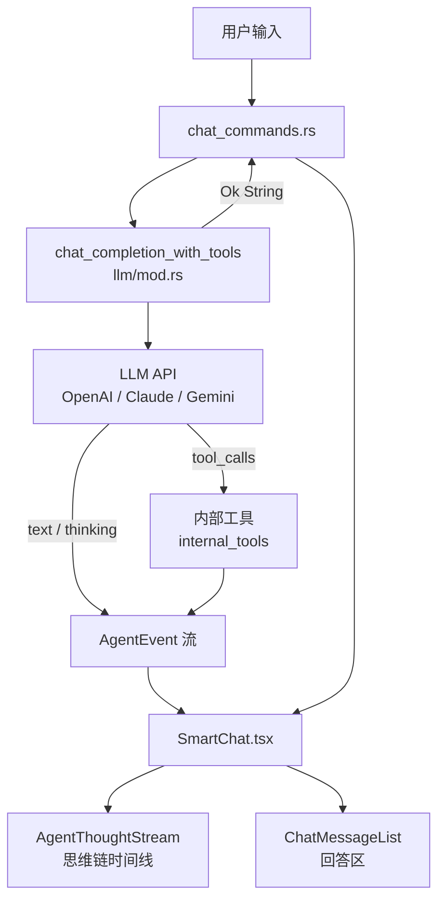
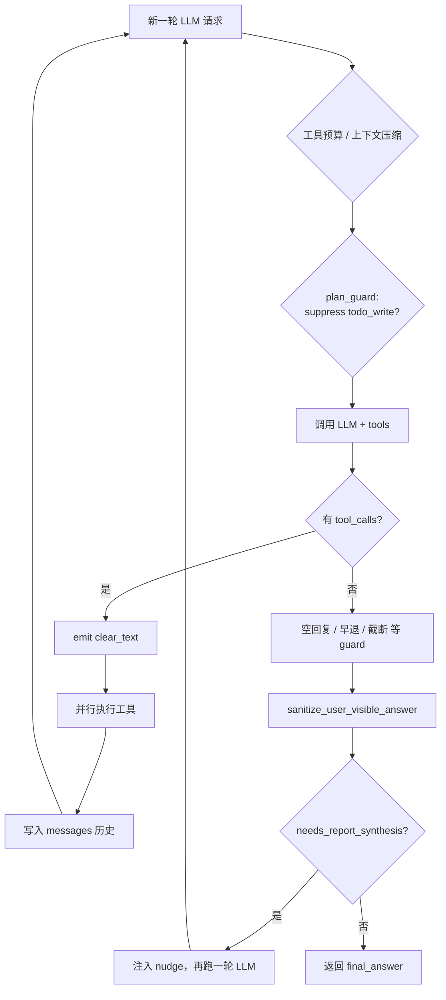

# ZettelAgent AI Agent 编排与架构复盘

> 文档日期：2026-07-04  
> 用途：记录当前 Agent 编排架构、已遇到的问题、已做修复与后续方向，便于团队复盘。

---

## 1. 总览

ZettelAgent 的 **Agent 模式**（区别于 RAG 模式）采用 **Tool Calling Loop** 编排：LLM 在循环中决定是否调用工具，直到不再返回 `tool_calls` 时输出最终文本。

交互范式对齐 Cursor / Manus / Genspark 一类产品：

- 可折叠的 **思维链 trace**（计划 + 思考 + 工具调用）
- 独立的 **「回答」** 区域（用户可见的最终交付物）
- **Plan checklist**（`todo_write` 驱动的 4/4 进度条）

产品形态差异：我们是 **单 Agent + 知识库领域工具**（search、lint、graph、patch_note 等），不是 Manus 的浏览器/虚拟机自治栈，也不是 Cursor 的多子 Agent IDE 集成。

---

## 2. 架构图

### 2.1 端到端数据流



### 2.2 单轮 Tool Loop 内部



---

## 3. 核心模块与文件

| 模块 | 路径 | 职责 |
|------|------|------|
| Tool Loop 主循环 | `src-tauri/src/llm/mod.rs` | LLM 循环、事件发射、guard、synthesis retry |
| Plan 与执行耦合 | `src-tauri/src/llm/plan_guard.rs` | `todo_write` 与真实工具的执行约束 |
| 系统 Prompt | `src-tauri/src/llm/prompts.rs` | Agent 角色、工具路由、行为纪律 |
| 内部工具 | `src-tauri/src/internal_tools/` | run_lint、get_vault_stats、patch_note 等 |
| Chat 入口 | `src-tauri/src/commands/chat_commands.rs` | 组装 messages、启动 agent loop |
| 文件日志 | `src-tauri/src/chat_file_log.rs` | agent.log / rag.log |
| 事件处理 | `src/components/chat/SmartChat.tsx` | 监听 `agent-event`，维护 timeline 与 content |
| 思维链 UI | `src/components/chat/AgentThoughtStream.tsx` | trace 展开、plan 清单、工具卡片 |
| 回答提升 | `src/components/chat/agentAnswer.ts` | 泄漏过滤、从 timeline 提升完整报告 |

### 3.1 AgentEvent 类型

定义于 `llm/mod.rs` 的 `AgentEvent` enum：

| 事件 | 含义 | 前端去向 |
|------|------|----------|
| `thinking` | 模型推理片段 / orchestration 状态 | timeline（`type: thought`） |
| `text_delta` | 可见文本流 | 工具循环：**仅 timeline**；synthesis（`clear_text answer_stream=true` 之后）：**仅 `content`（回答区）** |
| `clear_text` | 清空 content 缓冲 | `answer_stream: false` → 工具迭代间清 narration；`true` → synthesis 开始前清缓冲并标记回答流 |
| `plan_update` | `todo_write` 步骤列表 | `agentPlanSteps` |
| `tool_*` | 工具检测/开始/结果 | timeline 工具卡片 |
| `done` | 本轮结束 | 停止 streaming |

---

## 4. 编排机制详解

### 4.1 Plan（`todo_write`）与执行解耦

**设计意图**：`todo_write` 只更新 UI 计划条，**不执行任何工具**。真实工作由 run_lint、get_vault_stats 等完成。

**plan_guard  enforcement**：

1. **`format_todo_write_result`**：返回结构化 JSON（含 `next_required_tool`），不再返回裸 `"ok"`。
2. **`should_suppress_todo_write`**：当前 in_progress 步骤对应的工具尚未执行时，从工具列表中**隐藏** `todo_write`。
3. **`check_premature_exit`**：若只调了 `todo_write` 或计划未完成就试图结束，注入 nudge 并 `continue` loop（最多 3 次）。
4. **`suppress_todo_write_system_message`**：向 messages 注入系统约束（英文）。

### 4.2 工具间 `clear_text`

每次检测到 `tool_calls` 后，后端 emit `ClearText`，前端将 `message.content` 置空。

- **目的**：避免工具调用前的叙述性文字与工具调用后的再生成重复出现在「回答」区。
- **副作用**：详细分析若写在工具迭代间的 `text_delta` 里，只会留在 **timeline**，不会进入最终 `content`。

这是「思维链详细、回答简略」的**架构根因之一**。

### 4.3 其他 Guardrails

| 机制 | 位置 | 作用 |
|------|------|------|
| 重复工具拦截 | `mod.rs` | 相同 name+args 的调用返回 Error，防无限 loop |
| 工具预算上限 | `AgentExecutionConfig` | `max_total_tool_calls`，触顶强制 synthesis |
| 分类预算 | `mod.rs` | web_search ≤5、db search ≤10 等 |
| 写操作审批 | `ApprovalRequired` 事件 | patch_note 等需用户确认 |
| 空回复 retry | `mod.rs` | 仅 todo_write / thinking 被吞 / plan in_progress 时 nudge |
| 上下文压缩 | `compress_context_window` | 长对话时压缩 history |
| 非原生 reasoning | `prompted_thinking.rs` | 不支持 native thinking 的模型注入 `<thought>` 格式 |

### 4.4 最终答案交付

| 层 | 机制 | 说明 |
|----|------|------|
| 后端 | `classify_task_kind` | 零成本任务分类：DiagnosticReport / SearchAnalysis / Curate / Write / General |
| 后端 | `needs_mandatory_synthesis` | 诊断类必合成；搜索/整理 ≥2 工具；General ≥3 工具 |
| 后端 | `plan_is_complete` | **计划门禁**：所有 step 为 `done` 且各步命名工具均已执行后，才允许 synthesis |
| 后端 | `incomplete_plan_enforcement` | 计划未完成时 nudge 继续执行剩余步骤（无 3 次 retry 上限） |
| 后端 | `run_synthesis_pass` | **固定 synthesis 阶段**：干净 context、无 tools、ClearText 后流式输出 |
| 后端 | `build_synthesis_context` | 过滤 plan_guard / budget / duplicate 等 orchestration 噪声 |
| 后端 | `sanitize_user_visible_answer` | 剥离泄漏的系统指令 |
| 后端 | stub fallback | 非 mandatory 路径上 `needs_report_synthesis` 仍触发 `stub_retry` |
| 前端 | `pickAgentFinalAnswer` | timeline 提升兜底 |

**任务型 pipeline（2026-07-04）**：

```
DiagnosticReport query → tool loop → (plan 全部 done) → mandatory synthesis_pass → 完整报告
SearchAnalysis (≥2 tools) → tool loop → (plan 全部 done) → mandatory synthesis_pass
WriteAction → tool loop → 直接返回（写作任务不强制二次合成）
```

计划未完成时：`plan_incomplete_block` 阻止 loop 退出；`plan_synthesis_deferred` 阻止 mandatory/stub synthesis。

### 4.5 Multi-Agent 路由（现状）

| Agent | 默认是否运行 |
|-------|-------------|
| `unified` | ✅ 绝大多数请求 |
| `knowledge` / `creator` / `curator` | 仅 Composite pipeline 或 `[ROUTE:xxx]` handoff |

详见 `agents/orchestrator.rs`、`agents/registry.rs`。

### 4.6 约束语 i18n

根据用户 query 是否含中文（`user_prefers_zh`）选择 **zh / en** 编排语，覆盖：

- `todo_write` 返回值、plan_guard nudge、duplicate 警告  
- 预算提醒、工具上限、停滞检测、工具失败恢复、截断 nudge、空回复 nudge  
- synthesis thinking UI、synthesis 指令（`synthesis_instruction`）  
- `sanitize_user_visible_answer` / `is_orchestration_noise` 中英泄漏模式  
- 前端 `agentAnswer.ts` 中英 meta-stub 与泄漏过滤

---

## 5. 已遇到的问题（案例复盘）

### 5.1 问题 A：计划步骤卡在 in_progress，turn 结束无输出

**现象**（2026-07-04 12:28 日志）：

```
tool_detected name=todo_write
clear_text
tool_result name=todo_write
turn_complete chars=0
```

**根因**：模型连续调用 `todo_write` 更新计划 UI，但从未调用 `run_lint` 等真实工具；loop 在无 content、无 tool_calls 时正常退出。

**修复**：

- `should_suppress_todo_write` 隐藏重复 todo
- `check_premature_exit` 阻止早退
- `format_todo_write_result` 明确告知 `next_required_tool`
- 空回复 retry（`only_todo_write` 分支）

---

### 5.2 问题 B：「Do not repeat the same tool calls.」出现在回答区

**现象**（2026-07-04 12:48–12:52 日志，用户截图）：

最终 `text_delta` 以系统约束语的 echo 开头，随后是英文 meta 摘要。

**根因**：

1. `todo_write` 返回值、`plan_guard` nudge、重复工具 warning 均为**英文系统语**，进入 model context。
2. 模型在最后一轮把这些约束**复读**到 user-visible `text_delta`。
3. 当时无 `sanitize_user_visible_answer`，原文直达前端。

**日志特征**：

```
plan_guard suppress_todo_write
...
turn_complete chars=928
（无 synthesis_retry 记录 — 修复前）
```

**修复**：

- 后端 `sanitize_user_visible_answer`
- synthesis retry 的 nudge 中明确禁止 echo 系统指令
- 前端 `stripAgentAnswerLeaks`

---

### 5.3 问题 C：思维链有完整报告，「回答」反而更简略

**现象**：用户展开 trace 可见完整结构性盲区分析；「回答」区只有 "I have completed…" + 几条 bullet。

**根因（架构层，非 UI bug）**：

| 通道 | 写入时机 | 是否被 clear_text 清除 | 用户在哪里看到 |
|------|----------|------------------------|----------------|
| timeline（thinking / text_delta） | 工具循环每轮之间 | 否 | 思维链 trace |
| content（最终回答） | synthesis 阶段 `text_delta`（`answer_stream=true` 后） | 工具迭代间会被 clear | 「回答」区 |

> **注意**：synthesis 的 `text_delta` 不得写入 timeline，否则思考链与「回答」区会同步流式重复（见 `SmartChat.tsx` `text_delta` + `stripReportFromTimeline`）。

模型习惯：工具循环中写详细分析 → 计划 4/4 完成后写短 meta 摘要。

**修复（缓解，非根治）**：

- `needs_report_synthesis` + 一次 synthesis retry
- `pickAgentFinalAnswer` 从 timeline 提升内容

**根治方向**：工具全部完成后 **固定** 进入 synthesis pass，不依赖 stub 检测。

---

### 5.4 问题 D：数据/UI 细节（已修）

| 问题 | 修复 |
|------|------|
| Agent 图标显示为 ♦ | `IconBrain` → `IconRobot` |
| trace 展开后 plan 在 body 上方 | `AgentThoughtStream` 调整顺序：body 紧跟 header |
| stage 状态行与 thinking 合并 | `isStage` 条目不参与 thinking 合并 |
| 前端 debug UI 干扰排查 | 移除 `ReplyDebugLog`，改用 `logs/agent.log` |

---

## 6. 与 Cursor / Claude Code 对比（2026-07-04 详细评估）

**编排范式上，已经很接近了；产品和工程成熟度上，还不是同一量级。**

更准确地说：**「Agent 怎么跑」这条链路，跟 Cursor / Claude Code 是同一套语言；「能做什么、有多稳、跑多大任务」还差一截。**

---

### 已经对齐的部分（≈ 80% 编排骨架）

| 能力 | ZettelAgent 现状 | Cursor / Claude Code |
|------|------------------|----------------------|
| Tool loop（调工具 → 再调 LLM 直到结束） | ✅ | ✅ |
| `todo_write` 计划条 + 真实工具解耦 | ✅ plan_guard | ✅ 同类 |
| 过程 trace / 最终回答分离 | ✅ | ✅ |
| **固定 synthesis pass**（诊断/多工具） | ✅ mandatory | ✅ 有类似阶段 |
| 约束语 i18n + 干净 synthesis context | ✅ 中英 | ✅ 多语言场景 |
| 泄漏过滤 / stub 检测 | ✅ | ✅ |
| 重复工具拦截、预算、停滞恢复 | ✅ | ✅ |
| 写操作审批 | ✅ | ✅ |

你之前踩的坑——**只规划不干活、思维链详细但回答简略、系统语泄漏**——在架构层已经有针对性修复，和 Cursor/Claude Code 处理的是**同一类问题**。

---

### 还没对齐的部分（差距在这里）

#### 1. 执行环境完全不同

| | ZettelAgent | Cursor / Claude Code |
|--|-------------|----------------------|
| 工具域 | 知识库（笔记、图谱、lint） | 代码库 + 终端 + Git + LSP |
| 自治规模 | 单 vault 分析/整理 | 整仓 refactor、跑测试、改多文件 |

**不是编排差，是产品边界不同。**

#### 2. 子 Agent / 并行任务

- **Cursor**：subagent 并行 explore、独立上下文、可 resume  
- **Claude Code**：终端 Agent + increasingly 任务分解  
- **你们**：有 Knowledge/Creator/Curator registry，但 **90%+ 走 unified**；无并行 subagent

#### 3. 工程积累与 edge case

Cursor/Claude Code 多年线上打磨：

- 超大 context 下的工具结果压缩策略更细  
- 更多模型/Provider 特化  
- MCP、Rules、Skills 生态更深  
- 长任务 checkpoint / 取消 / 恢复更成熟  

你们刚补上 synthesis 和 i18n，**还需要真实使用沉淀**。

#### 4. 一些细节仍弱一档

- synthesis 失败暂无自动重试  
- 超大工具结果（如 `get_graph` 2 万字符）合成前未专门压缩  
- 专家 Agent pipeline 对用户几乎不可见  
- 无 IDE 级文件监听/增量上下文

---

### 一张定位图

```
编排范式（怎么跑 Agent）     ████████░░  ~80%  接近 Cursor/CC
交付可靠性（报告/回答质量）   ███████░░░  ~70%  刚补齐 synthesis
产品能力（能干什么）         ████░░░░░░  ~40%  知识库 vs 全栈开发
工程成熟度（edge case）      █████░░░░░  ~50%  持续迭代中
```

---

### 一句话结论

> **跟 Cursor / Claude Code「一样了吗」？**  
> —— **Agent 编排思路和核心机制，可以说「是同一类产品了」。**  
> —— **整体体验和对等性，还不能说「几乎一样」**——差在子 Agent 并行、执行环境、长任务自治，以及线上打磨深度。

如果目标是 **「知识库 Agent 达到 Cursor 级可靠性」**，当前最需要验证的是：中英文各跑几次诊断类 query，看 log 里 `synthesis_pass mandatory` + 回答质量是否稳定。  
如果目标是 **「跟 Claude Code 一样写代码改项目」**，那是另一条产品线，不是编排微调能解决的。

### 离 Cursor 级还差哪 5 项（优先级清单）

> 目标：**知识库 Agent 达到 Cursor 级可靠性**（非 IDE/写代码产品线）。  
> 排序依据：用户感知 impact × 实现成本 × 与当前架构的衔接度。

| 优先级 | 项 | 为什么重要 | 做什么 | 主要改动面 | 预估 |
|:------:|---|----------|--------|------------|------|
| **P0** | 1. synthesis 失败自动重试 | mandatory pass 已上线，但空回复/异常时仍回退 loop stub，用户仍会看到「思维链详细、回答简略」 | ✅ `run_synthesis_with_retry` 最多 2 次；仍失败则前端 `pickAgentFinalAnswer` timeline 提升 | `llm/mod.rs`、`agentAnswer.ts` | 小 |
| **P0** | 2. 超大工具结果压缩 | `get_graph` 等 JSON 可达 2 万字符，撑爆 synthesis context，报告质量不稳定 | ✅ `compress_tool_content_for_synthesis` 保留 `_summary` + 聚类/笔记统计 | `plan_guard.rs` | 中 |
| **P1** | 3. 可观测性 | 没有 answer 来源标记，复盘只能靠猜 log | ✅ `turn_complete source=… preview=…`；`Done.answer_source`；dev badge | `llm/mod.rs`、`ChatMessageList.tsx` | 小 |
| **P1** | 4. 专家 Agent / Composite 产品化 | registry 有 knowledge/creator/curator，但 90%+ 走 unified，Cursor 的「分工」对用户不可见 | ✅ `PipelineProgress` → trace `pipeline` 条目；handoff Step 1/2 可见 | `orchestrator.rs`、`AgentThoughtStream.tsx` | 中 |
| **P2** | 5. 并行 subagent | Cursor 级长任务靠并行 explore + 独立上下文；当前单 loop 串行 | 先不做全并行：可选「research 子任务」fork，完成后 merge 到 synthesis context；需 cancel/resume | 新 `subagent.rs`、orchestrator | 大 |

#### 建议排期

```
近期（1–2 迭代）  →  P0-1 synthesis 重试  +  P0-2 工具结果摘要
中期（2–4 迭代）  →  P1-3 可观测性      +  P1-4 Composite UI
远期（按需）      →  P2-5 并行 subagent（仅当有多步调研/长任务需求时）
```

#### 每项验收标准

1. **synthesis 重试** — 模拟 synthesis 返回空，log 有 `synthesis_pass_retry`；「回答」区仍有完整中文/英文报告。  
2. **工具结果压缩** — `get_graph` 大结果后 synthesis 仍稳定输出；context token 不超模型上限。  
3. **可观测性** — `agent.log` 每轮有 preview + source；dev UI 可见来源标签。  
4. **Composite 产品化** — 「先搜索然后写笔记」类 query 在 trace 显示 Step 1/2 Agent 名称，非仅 unified。  
5. **并行 subagent** — 可取消；子任务结果合并进最终 synthesis；无 zombie loop。

#### 刻意不做（不属于「知识库 Agent 追 Cursor 可靠性」）

- IDE 终端 / Git / LSP 集成（Claude Code 产品线）  
- 浏览器 / VM 自治（Manus 产品线）  
- 换模型路由或多 Provider 编排（可独立立项）

---

## 7. 调试指南

### 7.1 日志位置

| 环境 | agent.log | rag.log |
|------|-----------|---------|
| Release | `%APPDATA%\com.zettelagent.app\logs\` | 同目录 |
| Dev | 上述 + `ZettleAgent_experiment/logs/` 镜像 | 同目录 |

### 7.2 关键 log 行

| 日志 | 含义 |
|------|------|
| `plan_guard suppress_todo_write` | 已隐藏 todo_write，等真实工具 |
| `plan_guard_blocked attempt=N` | 早退被拦截 |
| `empty_response_retry=N` | 空回复/仅 planning 被 nudge |
| `plan_advance tool=… steps_done=N/M` | 工具成功后推进计划 checklist |
| `plan_incomplete_block steps_done=N/M` | 计划未完成，阻止 loop 提前结束 |
| `plan_synthesis_deferred plan_incomplete` | 计划未完成，推迟 mandatory/stub synthesis |
| `task_pipeline diagnostic_report` | 诊断类任务，将触发 mandatory synthesis |
| `synthesis_pass mandatory\|stub_retry` | 固定 synthesis 阶段开始 |
| `synthesis_pass_done mandatory chars=N` | synthesis 完成，N 为最终报告字数 |
| `synthesis_pass_error …` | synthesis 失败，回退 loop 答案 |
| `clear_text` | 工具调用前清 content（timeline 保留） |
| `turn_complete chars=N` | 返回给前端的最终字符串长度 |
| `done total_tool_calls=N` | 本轮总工具调用次数 |

### 7.3 典型排查流程

1. 打开 `agent.log`，定位 `=== ZettelAgent log started` 会话块。
2. 数 `tool_detected`：是否只有 `todo_write`？
3. 看 `plan_guard_blocked` / `empty_response_retry` 是否触发。
4. 对比最后一轮 `text_delta` 累积量（`turn_complete chars`）与 trace 中 timeline 内容量。
5. 确认是否有 `synthesis_pass mandatory` / `synthesis_pass_done`；若无且 chars 偏短，检查 `task_kind` 分类是否命中。

---

## 8. 后续建议（按优先级）

### 已完成（2026-07-04）

1. **synthesis 失败重试** — `run_synthesis_with_retry`（mandatory / stub_retry 各最多 2 次）；前端 timeline 兜底  
2. **工具结果自动摘要** — `compress_tool_content_for_synthesis` 在 `build_synthesis_context` 中应用  
3. **可观测性** — `turn_complete source=… preview=…`；`Done { answer_source, answer_preview }`；dev 模式 source badge  
4. **Composite / 专家 Agent 可见性** — `pipeline_progress` → trace `pipeline` 行；handoff Step 1/2  

### P2 — 远期

5. **并行 subagent** — 类似 Cursor Task 的多路 explore / 合并（registry 已有但未产品化）

---

## 9. 变更记录

| 日期 | 变更 |
|------|------|
| 2026-07-04 | 初版：架构说明、问题复盘、fix 记录、后续方向 |
| 2026-07-04 | plan_guard、sanitize、文件日志、UI 修复 |
| 2026-07-04 | **P0/P1 落地**：synthesis 重试、工具结果压缩、answer_source 可观测性、Composite pipeline trace |
| 2026-07-04 | §6 扩充：与 Cursor / Claude Code 详细对比评估 |

---

## 10. 相关代码入口（速查）

```
chat_completion_with_tools()     # src-tauri/src/llm/mod.rs
plan_guard::*                      # src-tauri/src/llm/plan_guard.rs
emit_agent_event()                 # src-tauri/src/llm/mod.rs
listen('agent-event')              # src/components/chat/SmartChat.tsx
pickAgentFinalAnswer()             # src/components/chat/agentAnswer.ts
log_agent()                        # src-tauri/src/chat_file_log.rs
```
